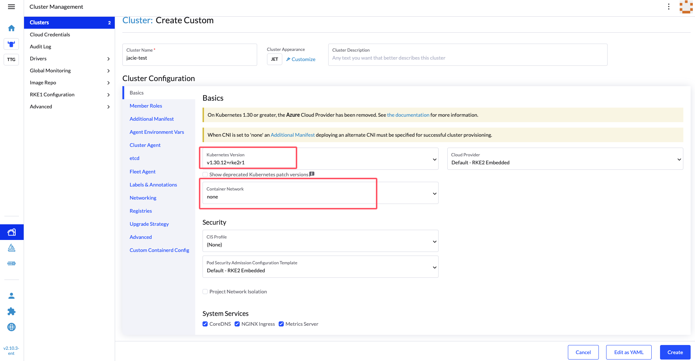
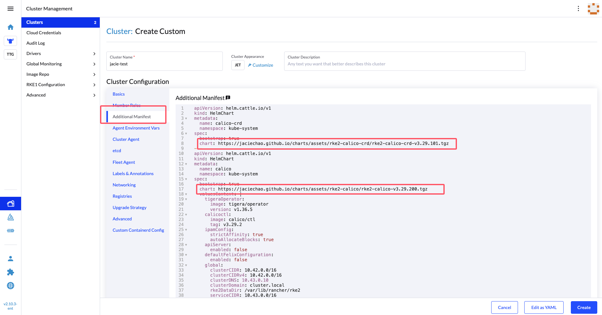
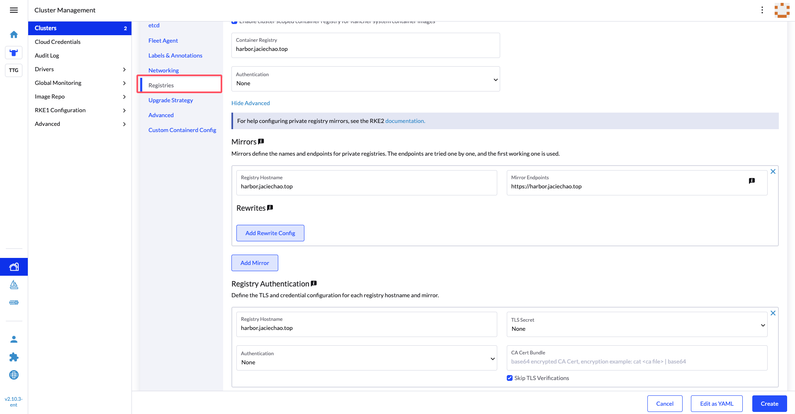
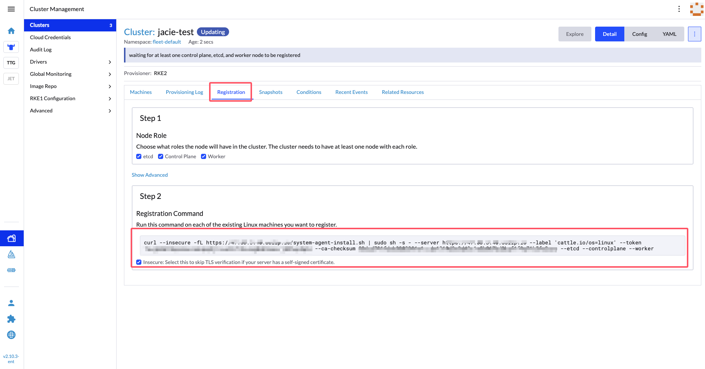

# charts

## mirror 镜像

请先将下列镜像 mirror 到内部私有镜像仓库：

- quay.io/tigera/operator:v1.36.5
- calico/node:v3.29.2
- calico/pod2daemon-flexvol:v3.29.2
- calico/cni:v3.29.2
- calico/typha:v3.29.2
- calico/kube-controllers:v3.29.2

## 使用方式

1. 将 Chart mirror 到内部私有 helm repo 中。
2. 在 Rancher 中创建 Custom RKE2 集群，选择 v1.30.x 的 RKE2 版本，Container Network 选择为 none

3. 左侧 Additionl Manifests 设置社区 calico manifest，示例在 `./manifests/calico-v3.29.2.yaml` 中。可以直接使用这个 manifest 进行验证，集群 cidr 使用默认的值。**注意：**请修改相关的 chart url 使用私有 helm repo 地址。

4. 设置 Registries 使用内部镜像仓库地址。

5. 保存集群
6. 在指定主机上运行注册节点命令。

7. 确认节点上 calico 相关组件运行是否正常。
